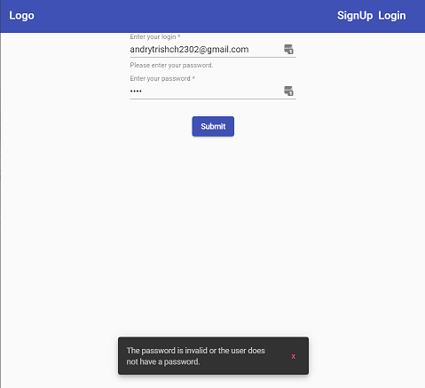

# [!Fitness tracker](https://ng-fitness-tracker-d5fd1.firebaseapp.com/training) - responsive web application created in Angular.
**Include** :
- SPA - Angular
- Authentication - FireAuth
- Database managment - Firestore
- Design and component logic - Angular Material
- Reactive approach - Rxjs
- Keeping stable state of the application - Ngrx 
- Deployed - Firebase hosting 
In next few photos, you can see the result or go to follow the link
**Login**

**Main**

**Active Training**

